# Project Summary Action

AI-powered project summaries from multiple data sources (GitHub, Slack), posted to multiple destinations (Slack, Notion).

## Features

- **Multi-Source Data Collection**
  - GitHub: PRs and Issues from multiple repositories
  - Slack: Messages, threads, reactions from multiple channels
- **Flexible Time Periods**: `last-7-days`, `last-month`, `last-quarter`, `YYYY-MM`, custom date ranges
- **Template-Based Summaries**: Pre-built templates (monthly-report, sprint-summary, release-notes)
- **Multi-Destination Output**: Post to Slack and/or Notion
- **Cross-Organization Support**: GitHub App tokens for accessing repositories across organizations

## Architecture

The action follows a four-phase pipeline: data collection, prompt generation, LLM processing, and output delivery.


### Key Components

1. **Data Collection**: GitHub CLI and Slack MCP server collect data in parallel
2. **Prompt Generation**: Template system constructs context-aware prompts with output format specifications
3. **LLM Processing**: Claude Code analyzes data, categorizes items, and generates summaries
4. **Output Delivery**: MCP tools post formatted content to Slack and/or Notion

### Data Flow

```mermaid
%%{init: {'theme':'default', 'themeVariables': { 'darkMode':'false', 'primaryColor':'#fff', 'primaryTextColor':'#000', 'primaryBorderColor':'#000', 'lineColor':'#000', 'secondaryColor':'#f0f0f0', 'tertiaryColor':'#fff', 'background':'#ffffff', 'mainBkg':'#ffffff', 'secondBkg':'#f0f0f0', 'noteBkgColor':'#fff3cd', 'noteTextColor':'#000', 'noteBorderColor':'#000', 'actorBkg':'#ffffff', 'actorBorder':'#000', 'actorTextColor':'#000', 'actorLineColor':'#000', 'signalColor':'#000', 'signalTextColor':'#000', 'labelBoxBkgColor':'#ffffff', 'labelTextColor':'#000', 'loopTextColor':'#000', 'activationBkgColor':'#f0f0f0', 'activationBorderColor':'#000', 'sequenceNumberColor':'#000'}}}%%
sequenceDiagram
    participant User as Workflow
    participant Action as Project Summary Action
    box rgba(255, 243, 224, 0.5) Data Source APIs
    participant GH as GitHub API
    participant SlackAPI as Slack API
    end
    participant Claude as Claude Code
    box rgba(252, 228, 236, 0.5) Output MCP Servers
    participant SlackMCP as Slack MCP
    participant NotionMCP as Notion MCP
    end

    rect rgb(255, 255, 255)
    User->>Action: Configure inputs
    Action->>GH: Fetch PRs & Issues
    GH-->>Action: github_data.json
    Action->>SlackAPI: Fetch messages & threads
    SlackAPI-->>Action: slack_data.json

    Action->>Action: Load template & build prompt

    Action->>Claude: Invoke with data files + prompt
    Claude->>Claude: Read & analyze data
    Claude->>Claude: Generate summary

    Claude->>SlackMCP: Post message (if configured)
    SlackMCP-->>Claude: ✓ Posted
    Claude->>NotionMCP: Create page (if configured)
    NotionMCP-->>Claude: ✓ Page created
    Claude->>NotionMCP: Add content blocks
    NotionMCP-->>Claude: ✓ Content added

    Claude-->>User: Summary posted ✓
    end
```



## Inputs

### Data Sources

| Input | Required | Default | Description |
|-------|----------|---------|-------------|
| `github_repositories` | No | - | Comma-separated repositories (`owner/repo,owner/repo2`) |
| `slack_channels` | No | - | Comma-separated Slack channel IDs (`C123,C456`) |

### Time Period

| Input | Required | Default | Description |
|-------|----------|---------|-------------|
| `period` | No | `last-month` | Time period: `last-7-days`, `last-month`, `last-quarter`, `YYYY-MM`, `YYYY-MM-DD..YYYY-MM-DD` |
| `start_date` | No | - | Start date (`YYYY-MM-DD`) - alternative to `period` |
| `end_date` | No | - | End date (`YYYY-MM-DD`) - required with `start_date` |

### Prompt Configuration

| Input | Required | Default | Description |
|-------|----------|---------|-------------|
| `template` | No | `monthly-report` | Template: `monthly-report`, `sprint-summary`, `release-notes`, `weekly-check` |
| `system_prompt` | No | - | Custom system prompt (overrides template's system_prompt) |
| `slack_output_format` | No | - | Custom Slack output format (overrides template's slack_output_format) |
| `notion_title_format` | No | - | Notion page title. See [Notion Title Modes](#notion-title-modes) below. |
| `notion_output_format` | No | - | Custom Notion output format (overrides template's notion_output_format) |
| `language` | No | - | Output language (`en`, `ja`, etc.) |
| `tone` | No | - | Tone: `formal`, `casual`, `technical` |

**Note**: You can override specific template values:
- `system_prompt`: Customize the AI's behavior and instructions
- `slack_output_format`: Customize Slack message format (only affects Slack output)
- `notion_title_format`: Customize Notion page title (see below)
- `notion_output_format`: Customize Notion page content (only affects Notion output)
- `language` and `tone`: Override template defaults
- Specify only what you want to customize; other values use template defaults

#### Notion Title Modes

The `notion_title_format` parameter supports three modes:

1. **Direct Title Mode** (no `{` characters):
   ```yaml
   notion_title_format: "Project Summary - Q1 2025"
   ```
   The title is used exactly as specified.

2. **Variable Format Mode** (contains `{` characters):
   ```yaml
   notion_title_format: "{repository} ({year_month})"
   # or
   notion_title_format: "📊 {period} Report"
   ```
   AI interprets variables and available data to generate the title. Common variables:
   - `{period}`: Full period description (e.g., "September 2025")
   - `{start_date}`: Start date (e.g., "2025-09-01")
   - `{end_date}`: End date (e.g., "2025-09-30")
   - `{year_month}`: Year-month format (AI will extract from dates, e.g., "2025-09")
   - `{template}`: Template name (e.g., "monthly-report")
   - `{repository}`: Repository name (from workflow context)

3. **Natural Language Mode** (contains `{` but with instructions):
   ```yaml
   notion_title_format: "Include repository name and year-month in YYYY-MM format"
   ```
   AI follows the natural language instruction to create the title.

### Output Configuration

| Input | Required | Default | Description |
|-------|----------|---------|-------------|
| `outputs` | **Yes** | - | Outputs: `slack`, `notion`, or `slack,notion` |
| `notification_slack_channel` | No* | - | Slack channel ID for posting |
| `slack_bot_token` | No* | - | Slack Bot Token |
| `slack_team_id` | No* | - | Slack Team ID |
| `notion_database_id` | No* | - | Notion database ID |
| `notion_token` | No* | - | Notion Integration Token |

*Required based on selected outputs and sources

### Authentication

| Input | Required | Default | Description |
|-------|----------|---------|-------------|
| `github_token` | No | `${{ github.token }}` | GitHub Token (supports GitHub App tokens) |
| `anthropic_api_key` | No* | - | Anthropic API Key |
| `claude_code_oauth_token` | No* | - | Claude Code OAuth Token |

*Either `anthropic_api_key` or `claude_code_oauth_token` required

**Note**: To set a timeout for the action, use `timeout-minutes` at the job or step level in your workflow:
```yaml
jobs:
  summary:
    runs-on: ubuntu-latest
    timeout-minutes: 15  # Set timeout at job level
```

## Outputs

| Output | Description |
|--------|-------------|
| `github-data-file` | Path to collected GitHub data JSON |
| `slack-data-file` | Path to collected Slack data JSON |
| `total-prs` | Total number of PRs collected |
| `total-issues` | Total number of Issues collected |

## Example Usage

### Basic Monthly Report

```yaml
- name: Generate monthly summary
  uses: nakamasato/claude-code-actions/project-summary@v1
  with:
    github_repositories: myorg/backend,myorg/frontend
    outputs: slack
    notification_slack_channel: C1234567890
    slack_bot_token: ${{ secrets.SLACK_BOT_TOKEN }}
    slack_team_id: ${{ secrets.SLACK_TEAM_ID }}
    anthropic_api_key: ${{ secrets.ANTHROPIC_API_KEY }}
```

### Sprint Summary with Slack Data

```yaml
- name: Generate sprint summary
  uses: nakamasato/claude-code-actions/project-summary@v1
  with:
    github_repositories: myorg/api
    slack_channels: C1234567890,C0987654321
    period: last-14-days
    template: sprint-summary
    outputs: slack,notion
    notification_slack_channel: C1234567890
    notion_database_id: ${{ secrets.NOTION_DB_ID }}
    slack_bot_token: ${{ secrets.SLACK_BOT_TOKEN }}
    slack_team_id: ${{ secrets.SLACK_TEAM_ID }}
    notion_token: ${{ secrets.NOTION_TOKEN }}
    anthropic_api_key: ${{ secrets.ANTHROPIC_API_KEY }}
```

### Weekly Progress Check

```yaml
- name: Weekly progress check
  uses: nakamasato/claude-code-actions/project-summary@v1
  with:
    github_repositories: myorg/project
    slack_channels: C1234567890  # team channel with meeting notes
    period: last-7-days
    template: weekly-check
    outputs: slack
    notification_slack_channel: C1234567890
    slack_bot_token: ${{ secrets.SLACK_BOT_TOKEN }}
    slack_team_id: ${{ secrets.SLACK_TEAM_ID }}
    anthropic_api_key: ${{ secrets.ANTHROPIC_API_KEY }}
```

### Cross-Organization with GitHub App

```yaml
- name: Generate GitHub App Token
  id: app-token
  uses: actions/create-github-app-token@v1
  with:
    app-id: ${{ secrets.APP_ID }}
    private-key: ${{ secrets.PRIVATE_KEY }}
    owner: target-org

- name: Generate release notes
  uses: nakamasato/claude-code-actions/project-summary@v1
  with:
    github_repositories: target-org/repo1,target-org/repo2
    start_date: 2024-01-01
    end_date: 2024-01-31
    template: release-notes
    outputs: notion
    notion_database_id: ${{ secrets.NOTION_DB_ID }}
    notion_token: ${{ secrets.NOTION_TOKEN }}
    github_token: ${{ steps.app-token.outputs.token }}
    anthropic_api_key: ${{ secrets.ANTHROPIC_API_KEY }}
```

### Scheduled Monthly Report

```yaml
name: Monthly Project Summary
on:
  schedule:
    - cron: '0 9 1 * *'  # 1st day of month at 9:00 UTC
  workflow_dispatch:

jobs:
  summary:
    runs-on: ubuntu-latest
    steps:
      - name: Generate monthly summary
        uses: nakamasato/claude-code-actions/project-summary@v1
        with:
          github_repositories: ${{ github.repository }}
          slack_channels: C1234567890
          outputs: slack
          notification_slack_channel: C1234567890
          slack_bot_token: ${{ secrets.SLACK_BOT_TOKEN }}
          slack_team_id: ${{ secrets.SLACK_TEAM_ID }}
          anthropic_api_key: ${{ secrets.ANTHROPIC_API_KEY }}
```

### Custom Notion Title Format

```yaml
# Example 1: Variable format mode - AI interprets variables
- name: Generate monthly summary with variable format
  uses: nakamasato/claude-code-actions/project-summary@v1
  with:
    github_repositories: myorg/repo
    period: last-month
    outputs: notion
    notion_title_format: "${{ matrix.repository }} ({year_month})"
    # Result: "myorg/repo (2025-09)"
    notion_database_id: ${{ secrets.NOTION_DB_ID }}
    notion_token: ${{ secrets.NOTION_TOKEN }}
    anthropic_api_key: ${{ secrets.ANTHROPIC_API_KEY }}

# Example 2: Natural language mode - AI follows instructions
- name: Generate with natural language title instruction
  uses: nakamasato/claude-code-actions/project-summary@v1
  with:
    github_repositories: myorg/repo
    period: last-month
    outputs: notion
    notion_title_format: "Include repository name and year-month in YYYY-MM format"
    # Result: AI generates appropriate title like "myorg/repo 2025-09"
    notion_database_id: ${{ secrets.NOTION_DB_ID }}
    notion_token: ${{ secrets.NOTION_TOKEN }}
    anthropic_api_key: ${{ secrets.ANTHROPIC_API_KEY }}

# Example 3: Direct title mode - Use as-is
- name: Generate with direct title
  uses: nakamasato/claude-code-actions/project-summary@v1
  with:
    github_repositories: myorg/repo
    period: last-quarter
    outputs: notion
    notion_title_format: "Q1 2025 Project Summary"
    # Result: "Q1 2025 Project Summary" (exactly as specified)
    notion_database_id: ${{ secrets.NOTION_DB_ID }}
    notion_token: ${{ secrets.NOTION_TOKEN }}
    anthropic_api_key: ${{ secrets.ANTHROPIC_API_KEY }}
```

### Custom Output Formats

```yaml
- name: Generate custom summary
  uses: nakamasato/claude-code-actions/project-summary@v1
  with:
    github_repositories: myorg/repo
    period: last-month
    template: monthly-report
    outputs: slack,notion
    # Custom Slack format
    slack_output_format: |
      *Monthly Update - {period}*

      We completed {pr_count} PRs this month!

      *Key Achievements*
      {achievements_list}

      *Next Steps*
      {next_steps}
    # Custom Notion title
    notion_title_format: "📊 Monthly Report - {period}"
    # Custom Notion format
    notion_output_format: |
      # Monthly Summary

      **Period:** {start_date} to {end_date}

      ## Metrics
      - PRs: {pr_count}
      - Issues: {issue_count}

      ## Highlights
      {highlights}
    notification_slack_channel: C1234567890
    notion_database_id: ${{ secrets.NOTION_DB_ID }}
    slack_bot_token: ${{ secrets.SLACK_BOT_TOKEN }}
    slack_team_id: ${{ secrets.SLACK_TEAM_ID }}
    notion_token: ${{ secrets.NOTION_TOKEN }}
    anthropic_api_key: ${{ secrets.ANTHROPIC_API_KEY }}
```

## Templates

### monthly-report (Default)
- **Language**: Japanese
- **Tone**: Casual
- **Use Case**: Regular team updates, monthly progress reports
- **Period**: last-month

### sprint-summary
- **Language**: English
- **Tone**: Professional
- **Use Case**: Sprint retrospectives, two-week summaries
- **Period**: last-14-days

### release-notes
- **Language**: English
- **Tone**: Formal
- **Use Case**: Customer-facing release notes, changelogs
- **Period**: Custom date range

### weekly-check
- **Language**: Japanese
- **Tone**: Professional
- **Use Case**: Weekly progress check, schedule alignment verification
- **Period**: last-7-days
- **Features**:
  - Task completion tracking
  - Delay detection
  - Commitment vs. actual progress comparison
  - Slack meeting notes analysis

## Setup Requirements

### Slack Bot
1. Create Slack App at https://api.slack.com/apps
2. Add bot scopes: `channels:history`, `channels:read`, `chat:write`
3. Install app to workspace
4. Invite bot to channels: `/invite @YourBot`
5. Get Bot Token and Team ID

### Notion Integration
1. Create integration at https://www.notion.so/my-integrations
2. Share target database with integration
3. Get Integration Token and Database ID

### GitHub App (Optional, for Cross-Org)
1. Create GitHub App with permissions: `Contents: Read`, `Pull requests: Read`
2. Install app to target organizations
3. Use `actions/create-github-app-token` to generate token

## Limitations

- Maximum 500 PRs per repository
- Maximum 500 Issues per repository
- Maximum 1000 Slack messages per channel
- Bot messages automatically filtered from Slack data
- Templates are built-in only (custom templates: future enhancement)

## Troubleshooting

### "fatal: not in a git directory" Error

When running the action, you may see this error during the Claude Code preparation phase:

```
fatal: not in a git directory
Failed to configure git authentication
```

**Cause**: This occurs when `claude-code-action` is called from within a composite action and tries to configure git.

**Solution**: This error can be safely ignored in most cases. The action will continue to execute normally. To suppress this warning:

1. Ensure your workflow has `actions/checkout@v4` before calling this action
2. Add a verification step in your workflow:

```yaml
- name: Checkout repository
  uses: actions/checkout@v4

- name: Verify git context
  run: git status

- name: Run Project Summary
  uses: nakamasato/claude-code-actions/project-summary@v1
  with:
    # ... your inputs
```

If the error persists and affects execution, please file an issue.

## Privacy Considerations

GitHub and Slack data are sent to Claude (Anthropic) for AI-powered analysis. Ensure:
- Use appropriate channels (avoid sensitive/confidential data)
- Review your organization's data handling policies
- Bot has access only to necessary channels/repositories

## License

MIT
